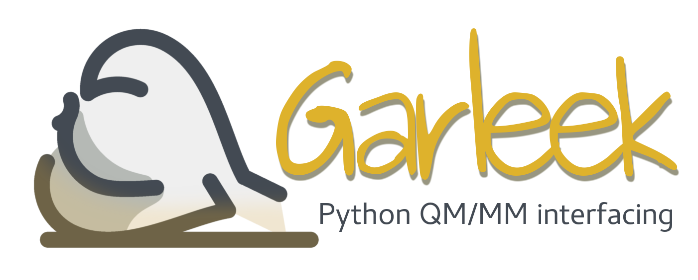

Garleek: An extra flavor to ONIOM
=================================

Garleek (recursive acronym for  *Garleek is Automated Resources for Layered Energies using External Keyword*)
allows you to perform QM/MM calculations by interfacing Gaussian with MM programs via its ``external`` keyword.
See :ref:`supported-software` for compatible programs.

    |    *Wel loved he garleek, oynons, and eek lekes,*
    |    *And for to drynken strong wyn, reed as blood.*
    |    -- **Geoffrey Chaucer**

.. toctree::
    :maxdepth: 1
    :caption: User guide

    intro.rst
    install.rst
    usage.rst
    developers.rst
    support.rst

.. toctree::
    :maxdepth: 2
    :caption: Tutorials

    tutorials.rst

Indices and tables
==================

* :ref:`genindex`
* :ref:`modindex`
* :ref:`search`
